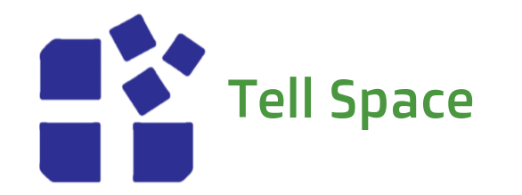

 <link rel="shortcut icon" type="image/png" href="Tell-Space-Logo-2.png">

# Welcome to Tell Space
<br>
## Tell Space is a technology development company. We make Mobile Apps, Websites, Projects and Computer Software. We allso do what we call 'Labs' wich are theorys, testing and tutorials using diffrent technologys and development tools.
<br>

# Projects
## Tell Space Projects:
- <a href="http://onyxbash.ml"> TheOnyxBashProject </a>
<br>
### The Onyx Bash Project is a collection of terminal programs or "tools" that makes it easyer to do simple terminal tasks such as: File management, installing packages, developing and more.
<br>
- <a href="#"> More Comming Soon... </a>
<br>
### We are allways trying to come up with new project ideas so stay tuned ;D
<br>

# Labs
## Tell Space Labs:
- <a href="#"> Not Yet </a>
<br>
### Remember that the site is under construction
<br>

# Development
## These are programming languages we use in our projects and labs
<br>
### HTML5
```html
<!DOCTYPE html>
<html>

  <head>
      <title> Website </title>
      <link rel="stylesheet" type="text/css" href="style.css">
      <script> 
      aler("Website pop up!");
      </script>
  
  </head>
  
  <body>
    <h1> Header </h1>
    <p> Text Pharagraph </p>
  
  </body>

</html>
```
<br>
### Shell Script
```sh
#!bin/bash
clear
echo "Hello World"
printf "Enter your name:"
read -r name_var
echo "Your name is :$name_var"
clear
exit
```
<br>
### Python
```python
var = 5
var1 = 5
print var+var1
input = raw_input("Enter Some Text: ")
print input
```
<br>
### C# (console applications)
```csharp
Console.WriteLine("Type Your Name;");
string name = Console.ReadLine();
Console.WriteLIne("Your name is" + name)
```
<br>

# Contact & Support
## Contact
Email: contact@tellspace.ml
<br>
<br>
Instagram: <a href="http://www.instagram.com/tellspace/"> @tellspace </a>
<br>
<br>
Hashtags: #tellspace, #onyxbash
<br>
<br>
Github: <a href="https://github.com/TellSpaceOfficial"> TellSpaceOfficial </a>
<br>
<br>
<br>
## Support
### Having problems with our projects or labs?
### Comment on github, instagram or email us:
<br>
Email: support@tellspace.ml
<br>
<br>
Instagram: <a href="http://www.instagram.com/tellspace/"> @tellspace </a>
<br>
<br>
Github: <a href="https://github.com/TellSpaceOfficial"> TellSpaceOfficial </a>
<br> <br>

# Take Our Feedback survey,
# And tell us what you think!
## <a href="https://tellspaceofficial.github.io/TellSpaceFeedback/"> Click Here </a>
<br>
<br>
## Contact Form
<br>
<br>